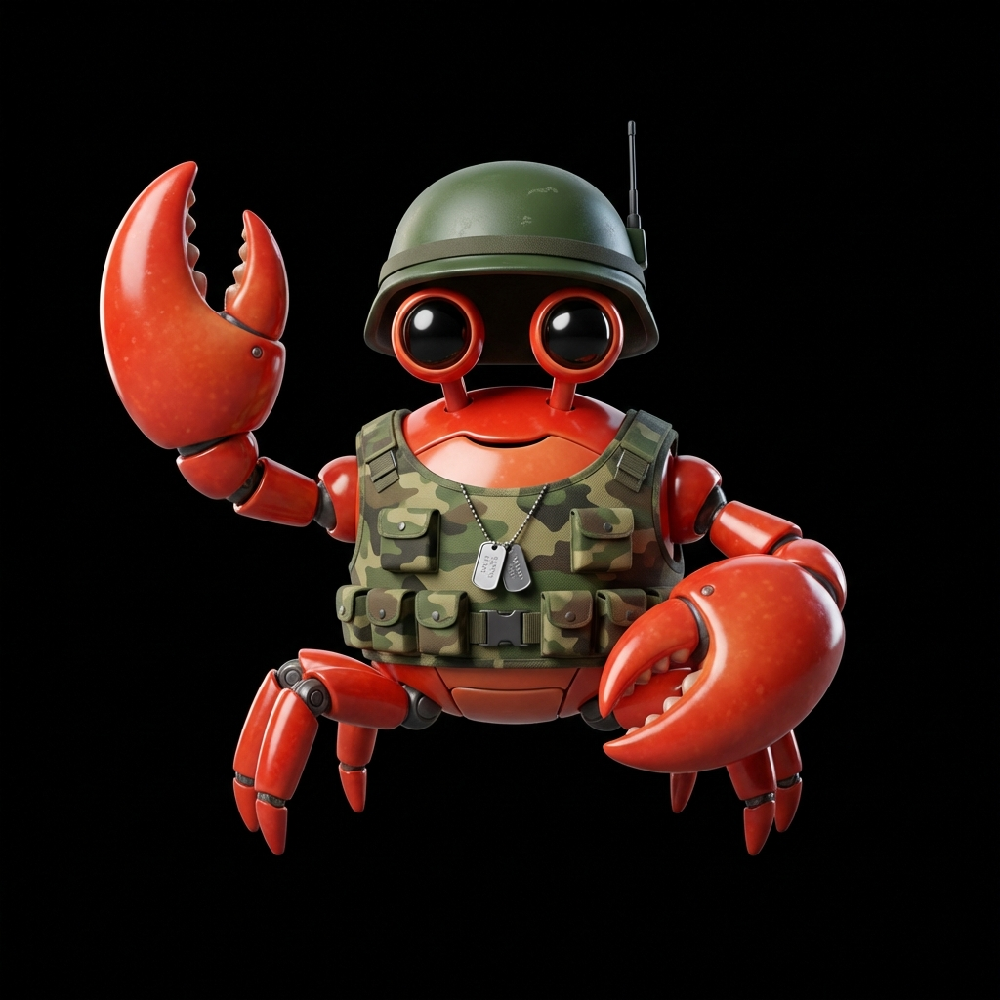

  

# 🛡️ ClawArmy: Tactical AI Agent Command Center

**ClawArmy** is an elite "Mission Control" platform for designing, deploying, and synchronizing AI Agent Specialists (**Antigravity Skills**). It enables developers to synthesize custom agent squads and inject them directly into their local workspaces with zero-friction automation.

---

## 🛰️ Mission Intelligence

### 🧬 High-Intelligence Architect
Design your perfect agent using our Smart Composer. Mix traits, define core instructions, and assign strategic priorities (MVP, Quality, Business). The system can automatically synthesize multiple marketplace agents into a single "Hybrid Specialist" using our **Synthetic Merging Logic**.

### ⚡ True One-Click Deployment
Deploying a specialist to your project has never been faster:
- **Local Injection**: If running locally, agents are hot-plugged directly into your `/agents/` folder.
- **Magic Shell Command**: On the web, click "One-Click Install" to auto-copy a PowerShell mission link. Paste it in your terminal, and the agent deploys itself instantly.
- **Tactical Kits**: Export any agent as a ready-to-use `.BAT` or `.ZIP` package with pre-configured directory hierarchies.

### ⚔️ Global HQ & Auto-Merge
Contribute your best specialists to the **Global Army**. Our backend features an **Auto-Merge Protocol**: if an agent with the same designation is published, the Command Center synthesizes their instructions and capabilities to create a stronger, evolve unit.

---

## ⚓ Deployment Steps for Users

1.  **Access the Command Center**: Navigate to [clawarmy.vercel.app](https://clawarmy.vercel.app).
2.  **Design Your Specialist**: Use the **Architect** view to define your agent's persona.
3.  **Execute Deployment**:
    *   Click **⚡ ONE-CLICK INSTALL**.
    *   If on the web, a **Magic Command** is copied to your clipboard.
    *   Open your terminal in your project root and **Paste/Run** the command.
4.  **Engage**: Your agent is now live in `agents/` and registered as a slash-command workflow in `.agent/workflows/`.

---

## 🛸 Technology Stack
- **Framework**: Next.js 15 (Turbopack)
- **Database**: Supabase (PostgreSQL)
- **Archiving**: JSZip (Tactical Kits)
- **Intelligence**: Word-based Fuzzy Match & Permutation Synthesis

---

**Built by Rikin Shah • Operational 2026**  
*ClawArmy is an independent specialist center for the Antigravity ecosystem.*
